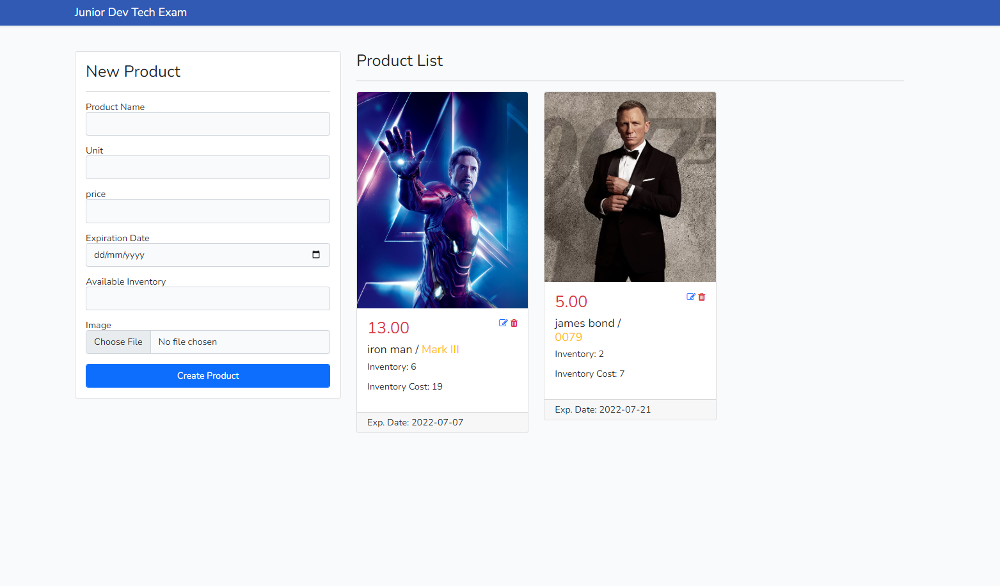
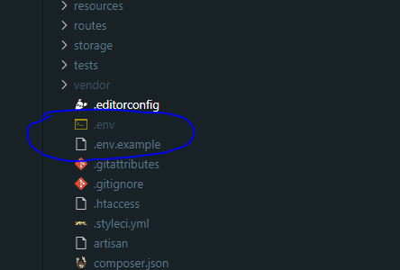
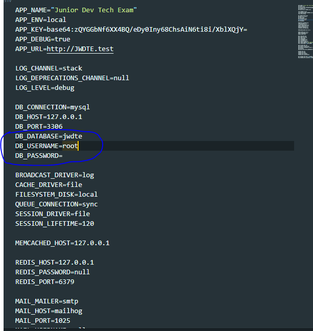

## Junior Dev Tech Exam

It's a simple CRUD web application developed using laravel with REST API integration for my application for Junior Web developer.

## Features
- Add New Product with file uploading
- Display Product information 
- Update product information
- deletion of the product

## Installation

To start the installation, clone this repository to your local machine

<code>git clone https://github.com/rowinsbie/Product-CRUD.git</code>

After cloning the project, go to the project directory by running the command below

<code>cd jdte/</code>

Once you're already in the project directory, run the commands below

<code>composer install</code>
 <code>npm install</code>
 <code>npm run dev</code>

## ENV. configuration

create an .env file and copy the contents of .env.example

In the .env, change the database configuration

Generate APP_KEY with the command below

<code>php artisan key:generate</code>
